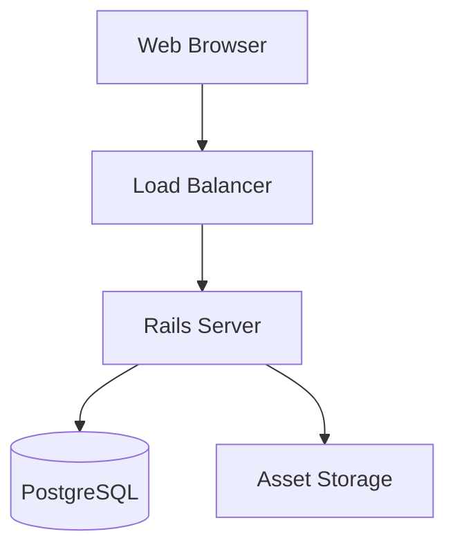
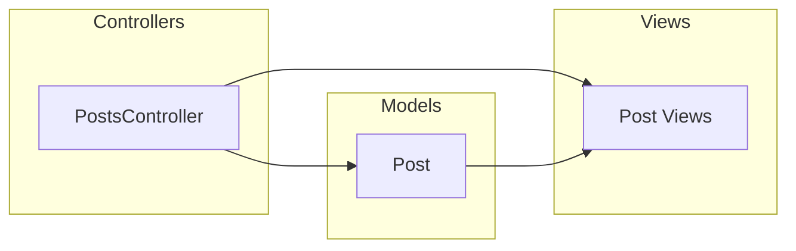
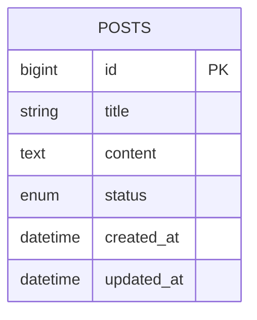
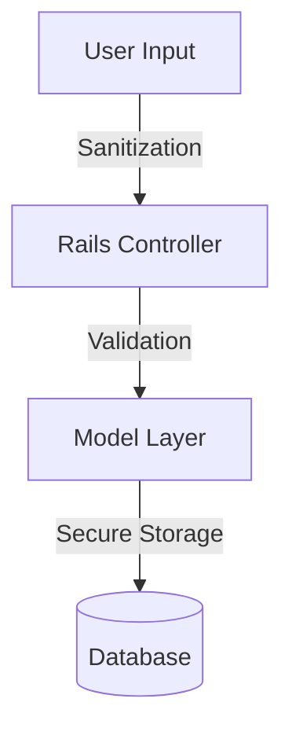
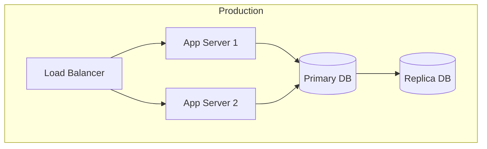
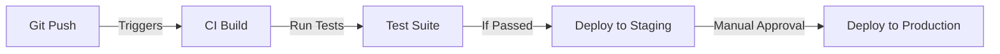

# Cursor Non-Technical Blog Platform - Architecture Document

**Status**: approved

## System Overview

The Cursor Non-Technical Blog Platform is designed as a Ruby on Rails monolithic application following MVC architecture patterns. The system prioritizes simplicity and maintainability while ensuring scalability for future enhancements.

### High-Level Architecture



## Component Architecture

### MVC Structure



### Database Schema



## Technical Decisions

### Framework & Language
- **Ruby on Rails 8.x**
  - Justification: Rapid development, convention over configuration, strong community
  - Benefits: Built-in security features, easy testing, great documentation

### Database
- **PostgreSQL 14+**
  - Justification: Robust, reliable, excellent Rails integration
  - Features used: Enum types, Full-text search (future)

### Frontend
- **Vanilla JavaScript**
  - Justification: Simpler implementation, easier maintenance, and better debugging experience
  - Implementation:
    - Use `fetch` API for AJAX requests
    - Direct DOM manipulation for UI updates
    - Event delegation for dynamic elements
    - Modular JavaScript organization in dedicated files
  - Benefits:
    - No additional dependencies
    - Straightforward debugging
    - Lower learning curve
    - Better control over behavior

## Security Architecture

### Authentication & Authorization
- No authentication required for MVP (view-only)
- Content management through basic HTTP authentication initially
- Prepared for Devise integration in future epics

### Data Protection


## Deployment Architecture

### Infrastructure


### CI/CD Pipeline


## Performance Considerations

### Caching Strategy
- Page caching for blog posts
- Fragment caching for common components
- Redis for future caching needs

### Database Optimization
- Proper indexing on frequently queried columns
- Soft deletion implementation
- Prepared statements for common queries

## Monitoring and Logging

### Key Metrics
| Metric | Tool | Threshold |
|:-------|:-----|:----------|
| Response Time | New Relic | < 200ms |
| Error Rate | Sentry | < 0.1% |
| Uptime | Pingdom | 99.9% |

### Logging
```ruby
config.logger = Logger.new(STDOUT)
config.log_level = :info
```

## Testing Strategy

### Test Types
- Unit tests (Models, Services)
- Integration tests (Controllers)
- System tests (End-to-end)

### Test Coverage Goals
| Component | Coverage Goal |
|:----------|:-------------|
| Models | 95% |
| Controllers | 90% |
| Views | 85% |

## Backup and Recovery

### Backup Strategy
- Daily full database backups
- Transaction logs every 30 minutes
- Stored in separate geographic region

## Open Questions
1. Should we implement server-side caching in MVP? No
2. Do we need a CDN for static assets in initial release? No
3. Should we implement rate limiting from day one? No

## Next Steps
1. Set up basic Rails application
2. Configure PostgreSQL
3. Implement Posts model and controller
4. Set up testing framework
5. Configure deployment pipeline 